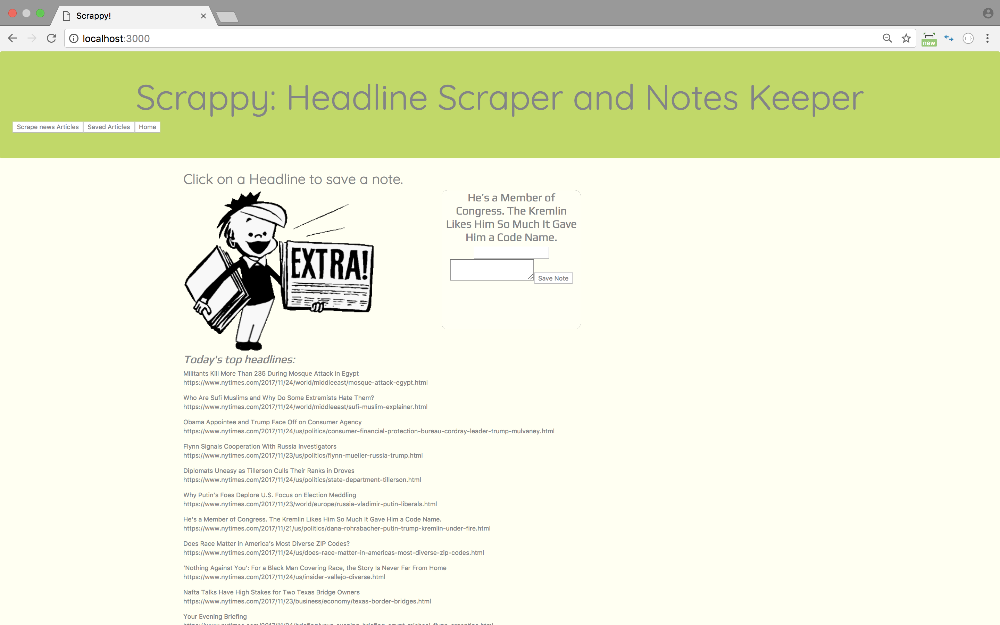
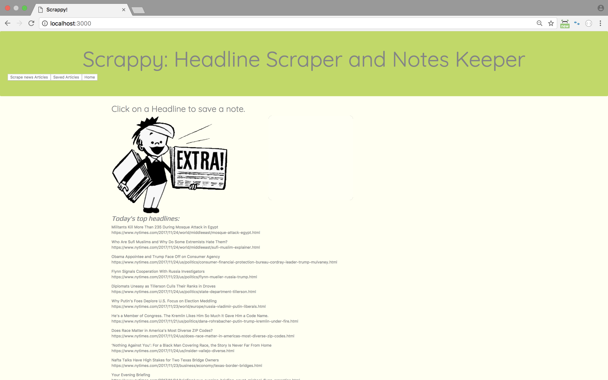
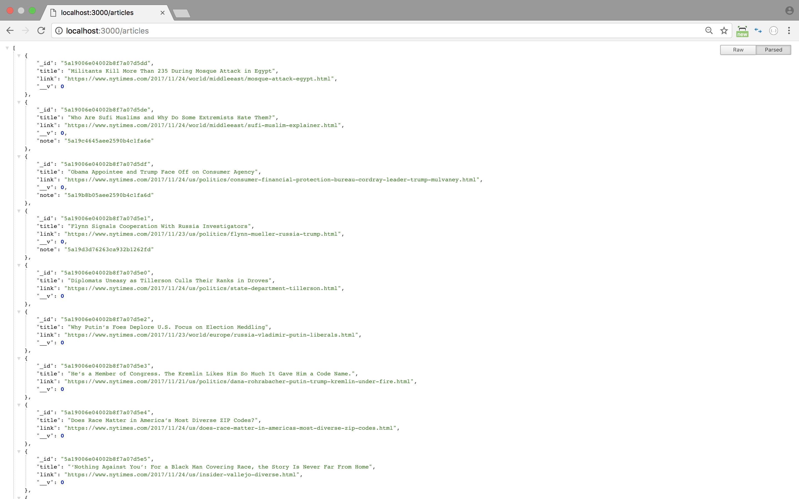

# Scrappy
Keep personal notes on today's top headlines.

## Getting Started
This application will look for the story heading in the New York Times and present a title and a link to the article.  When you click on the link, you will be able to save a note with your thoughts on the article.  

### Prerequesites
* npm packages
  * express
  * body-parser
  * mongoose
  * cheerio
  * axios
  * morgan
* Mongo DB
* Heroku for Deployment
* GitHub

**Thank you for your Attention!**

Gail Izaguirre (C) 2017.  All Rights Reserved.
